# Mindset Makeover Website - CI Project 1<!-- omit from toc --> 

**Mindset Makeover** is a made-up personal coaching website. It's part of a project for the Code Institute Diploma in Full-Stack Software Development. The main character of this project is Alex Richards. He's like a personal coach. His life story is full of challenges. But he chose to change his life. He did this by transforming how he thinks and deals with problems. This significant change helped him a lot. So, he started Mindset Makeover. This website is for assisting people to change their life stories like he did.

[Mindset Makeover Deployed Website](https://patrickhladun.github.io/mindset-makeover/)

## Table of Contents<!-- omit from toc --> 

- [Project Scope and Objectives](#project-scope-and-objectives)
  - [Website Objectives](#website-objectives)
  - [Key components of the website include:](#key-components-of-the-website-include)
- [User Experience](#user-experience)
  - [Audience Persona: Emily O'Sullivan](#audience-persona-emily-osullivan)
    - [Psychographics:](#psychographics)
    - [Behavioral Traits:](#behavioral-traits)
    - [Online Habits:](#online-habits)
    - [How Mindset Makeover Meets Emily's Needs:](#how-mindset-makeover-meets-emilys-needs)
  - [User Goals](#user-goals)
  - [User Stories](#user-stories)
  - [Five Planes of UX](#five-planes-of-ux)
    - [Strategy](#strategy)
    - [Scope](#scope)
    - [Structure](#structure)
    - [Skeleton](#skeleton)
    - [Surface](#surface)
  - [Wireframes](#wireframes)
    - [Mobile Wireframes](#mobile-wireframes)
    - [Desktop Wireframes](#desktop-wireframes)
- [Design](#design)
  - [Colours Scheme](#colours-scheme)
  - [Fonts](#fonts)
  - [Visuals](#visuals)
    - [Logo](#logo)
    - [Images](#images)
    - [Icons](#icons)
- [Pages and Features](#pages-and-features)
  - [Website Header Design](#website-header-design)
  - [Website Footer Design](#website-footer-design)
  - [Home Page](#home-page)
  - [Webinar Page](#webinar-page)
  - [About Page](#about-page)
  - [Contact Page](#contact-page)
  - [Thank you pages](#thank-you-pages)
  - [404 Page](#404-page)
  - [Legal Pages](#legal-pages)
- [Technology used](#technology-used)
- [Development and Deployment](#development-and-deployment)
- [Issues](#issues)
  - [Unresolved Issues](#unresolved-issues)
  - [Resolved Issues](#resolved-issues)
- [Testing and Validation](#testing-and-validation)
  - [Functional testing](#functional-testing)
    - [Website Header on Desktop](#website-header-on-desktop)
    - [Website Header on Mobile](#website-header-on-mobile)
    - [Website Footer](#website-footer)
    - [Home Page](#home-page-1)
    - [Webinar Page](#webinar-page-1)
    - [About Page](#about-page-1)
    - [Contact Page](#contact-page-1)
    - [Contact Page](#contact-page-2)
    - [Thank You and 404 Error Pages](#thank-you-and-404-error-pages)
  - [Google Page Insights Tests:](#google-page-insights-tests)
    - [Home Page](#home-page-2)
    - [Webinar Page](#webinar-page-2)
    - [About Page](#about-page-2)
    - [Contact Page](#contact-page-3)
    - [Thank You Contact Page](#thank-you-contact-page)
    - [Thank You Webinar Page](#thank-you-webinar-page)
    - [Thank You Newsletter Page](#thank-you-newsletter-page)
    - [404 Error Page](#404-error-page)
  - [HTML Validation](#html-validation)
  - [CSS Validation](#css-validation)
- [Further Improvements](#further-improvements)
- [Credits](#credits)
- [Acknowledgments](#acknowledgments)

## Project Scope and Objectives
[Back to Top](#table-of-contents)

Mindset Makeover is a personal coaching website. I have designed it to be simple and user-friendly. This project includes a home page, a place for signing up for newsletters, information about webinars, and a form to register for these webinars. There's also a contact page for questions or support.

### Website Objectives
[Back to Top](#table-of-contents)

1. **Educational Engagement**: I aim to provide content that helps visitors understand the importance of a positive mindset in their personal and professional lives.
2. **User Interaction**: I aim to engage users by offering newsletter sign-ups and webinar registrations, providing practical advice and inspiring stories.
3. **Brand Awareness**: I'm focusing on establishing Mindset Makeover as a known resource for personal development. Community building is beyond this project's scope, but I might add this later.
4. **User Conversion**: I want to encourage visitors to participate actively, especially in the free webinars Alex Richards hosts, where they can learn about positive thinking and self-empowerment.

### Key components of the website include:
[Back to Top](#table-of-contents)

- **Home page**: Introduces the mission of Mindset Makeover.
- **About page**: Detailing Alex Richards' journey and the philosophy behind Mindset Makeover.
- **Webinar registration page**: Details about the upcoming webinar and a place for users to sign up for webinars.
- **Contact page**: For user inquiries and support.

In the future, I might add a blog, a podcast, and other elements to the website. For now, my focus is on offering a streamlined and valuable experience.

The website's ultimate purpose is to not only deliver information but also inspire users to take steps towards enhancing their lives. The project will focus on delivering a seamless user experience with high-quality content, thereby fostering a positive community and brand loyalty.

## User Experience
[Back to Top](#table-of-contents)

### Audience Persona: Emily O'Sullivan
[Back to Top](#table-of-contents)

- **Age**: 35
- **Gender**: Female
- **Location**: Suburban area near Dublin, Ireland
- **Occupation**: Middle-level Manager in a Tech Company
- **Education**: Bachelor's Degree in Business Management
- **Marital Status**: Married with two children

#### Psychographics:
[Back to Top](#table-of-contents)

- **Interests**: Personal development, engaging in local community workshops, mindfulness retreats, reading self-help books, and exploring outdoor activities in Ireland.
- **Goals**: Striving to balance a demanding career with family life, aspiring to lead her team more effectively while nurturing a healthy home environment.
- **Challenges**: Facing stress from juggling professional responsibilities and parenting, combating self-doubt, and seeking ways to remain positive amidst work-life pressures.

#### Behavioral Traits:
[Back to Top](#table-of-contents)

- Actively seeks out resources for self-improvement and professional growth.
- Spends evenings browsing websites for articles and videos on leadership, personal development, and stress management.
- Participates in local community groups and online forums discussing career advancement and work-life balance.

#### Online Habits:
[Back to Top](#table-of-contents)

- Regularly uses social media platforms like LinkedIn for professional growth and Facebook for connecting with local community groups.
- Enjoys subscribing to newsletters focused on personal development and leadership skills.
- Prefers engaging with interactive online content, such as live webinars and virtual workshops, that offer real-time learning and interaction.

#### How Mindset Makeover Meets Emily's Needs:
[Back to Top](#table-of-contents)

- Mindset Makeover's webinars offer Emily practical and actionable advice to improve her leadership skills and manage stress, aligning with her goal to balance her professional and personal life.
- The newsletters provide ongoing support and insights, positively helping her navigate daily challenges.

### User Goals
[Back to Top](#table-of-contents)

1. **Personal Growth and Development**: Users visit the site for personal and professional growth resources and advice. They are looking to improve their mindset and life strategies.
2. **Implementing Practical Strategies**: Visitors are interested in finding actionable techniques that they can apply in their everyday lives. They value practical advice that leads to tangible changes.
3. **Overcoming Personal Challenges**: Many users deal with personal issues such as stress management, work-life balance, or confidence building. They are looking for support and strategies to overcome these challenges.
4. **Staying Informed with Regular Updates**: Visitors may want to subscribe to newsletters or updates to stay informed about new content, events, or learning resources.

### User Stories
[Back to Top](#table-of-contents)

1. **As a busy professional**, I want to find quick, actionable strategies for stress management so I can improve my work-life balance.
2. **As a recent graduate**, I want to learn how to set and achieve my career goals so I can navigate my path to success more effectively.
3. **As a team leader**, I want to learn techniques for positive leadership so I can create a better work environment for my team.
4. **As someone struggling with self-confidence**, I want to find resources for boosting self-esteem so I can feel more empowered in my personal and professional life.
5. **As a regular webinar attendee**, I want to sign up for online events easily so I can learn directly from experts like Alex Richards.
6. **As a lifelong learner**, I want to subscribe to a newsletter that provides regular insights and tips on personal growth so I can continuously improve myself.
7. **As a newcomer to personal development**, I want to understand the basics of mindset change so I can start making positive changes in my life.
8. **As a tech-savvy user**, I want a website that is easy to navigate on my phone or tablet so I can access content on the go.
9. **As a person looking for professional advice**, I want to contact the Mindset Makeover team easily so I can get answers to my specific questions.

### Five Planes of UX
[Back to Top](#table-of-contents)

#### Strategy
[Back to Top](#table-of-contents)

- **User Needs**: The website aims to cater to individuals seeking personal growth and mindset change. Users typically look for inspiration, practical advice, and strategies to overcome personal and professional challenges.
- **Business Objectives**: The primary goal is to establish Mindset Makeover as a leading resource in personal development and coaching. This includes building brand recognition, engaging users through webinars and newsletters, and ultimately creating a platform where users can find valuable, life-changing content.
  
#### Scope
[Back to Top](#table-of-contents)

- **Content Requirements**: The website will feature information about Alex and webinar details.
- **Functionality Requirements**: Key functionalities include a newsletter subscription, webinar registration, a contact form, and responsive navigation.

#### Structure
[Back to Top](#table-of-contents)

- **Interaction Design**: The site will be structured to facilitate easy navigation to essential sections like About, Webinar, Blog, and Contact. Interactivity will be smooth and intuitive, ensuring users can easily sign up for newsletters and webinars.
- **Information Architecture**: Content will be organized logically with clear headings and categories. A straightforward menu and clear CTAs (Call to Actions) will guide users through their journey on the site.

#### Skeleton
[Back to Top](#table-of-contents)

- **Navigation Design**: A clear and consistent navigation menu will be present on all pages. Key sections will be accessible from the homepage.
- **Interface Design**: The user interface will be clean and uncluttered, with a focus on readability and easy access to information. Important elements like subscription forms and contact details will be prominently displayed.
- **Information Design**: Content will be laid out in an easily digestible format, using headings, bullet points, and images where appropriate.

#### Surface
[Back to Top](#table-of-contents)

- **Visual Design**: The website will use a colour palette that inspires positivity. The design will be modern, professional, friendly and approachable.
- **Typography**: Readable, web-friendly fonts will be used for easy reading across devices.
- **Imagery**: High-quality images that resonate with personal growth and positivity will be used to engage users visually.

### Wireframes
[Back to Top](#table-of-contents)

Creating wireframes was crucial for developing Mindset Makeover. I chose Figma for this task because it's user-friendly and practical. I used actual text instead of placeholders in the wireframes, making them more detailed and reflective of the final site.

**Key Aspects of Wireframing**:

- **Layout Visualisation**: Using Figma, I quickly pictured the site's layout, ensuring it was easy to navigate.
- **Responsive Design**: I made wireframes for both desktop and mobile devices to guarantee a good user experience on any screen.
- **Real Content Integration**: Including actual text in the wireframes gave me a clearer view of the final look and functionality of the site.

Figma was a great help in streamlining my design process, allowing me to focus on the user experience right from the start.

[Link to Desktop and Mobile Figma Wireframes](https://www.figma.com/file/PAUeo3vZSOHDkS8Vv4Trvj/Mindset-Makeover?type=design&node-id=79-1820&mode=design)

#### Mobile Wireframes
[Back to Top](#table-of-contents)

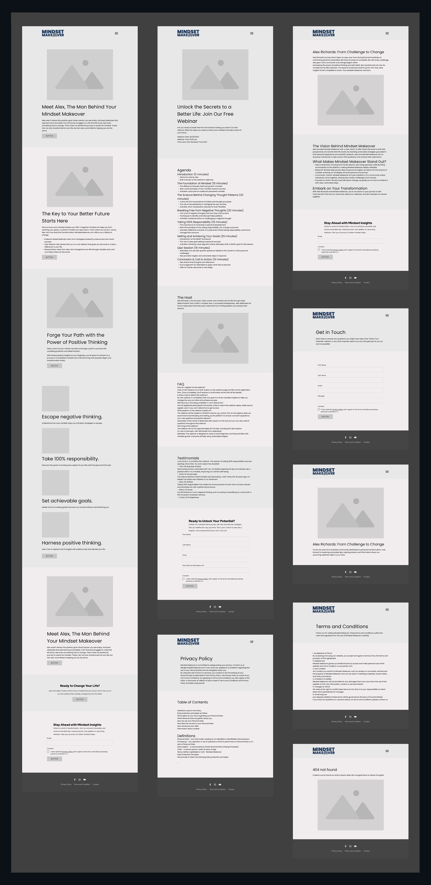

#### Desktop Wireframes
[Back to Top](#table-of-contents)

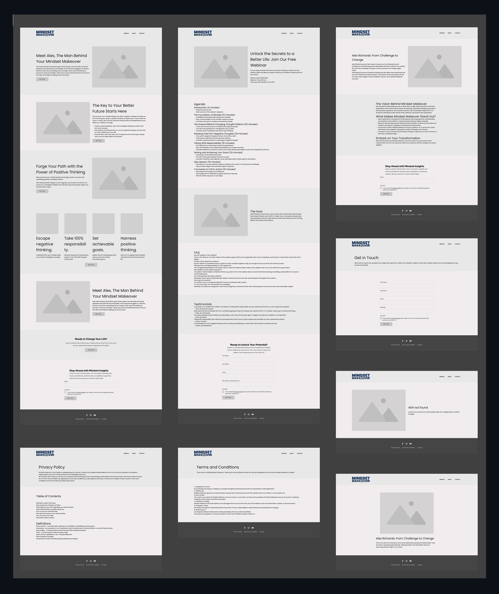

## Design
[Back to Top](#table-of-contents)

### Colours Scheme
[Back to Top](#table-of-contents)

In the design of the Mindset Makeover website, I carefully selected a colour palette of red, blue, and neutral grey to enhance the user experience and visual appeal.

**Red**, as the primary colour, is strategically used for main call-to-action buttons, links, and icons. It also serves as a background for testimonials, breaking the visual monotony and drawing attention. This vibrant colour symbolizes energy and action, aligning with the site's objective of motivating personal growth.

**Blue** is utilized for headings, darker background elements, and secondary buttons. Its calm and stable nature complements the red, providing a sense of tranquillity and trust, essential for a personal development website.

Additionally, **neutral grey** plays a subtle but crucial role. It is used for very light backgrounds, offering a clean, modern look that enhances readability. For the copyright section, a darker shade of grey provides a sophisticated contrast, grounding the site's design.

Together, these colours create a balanced and engaging visual experience. The combination of red and blue aligns with the website's core themes, while the grey adds a necessary balance, ensuring the design remains accessible and pleasing to the eye.

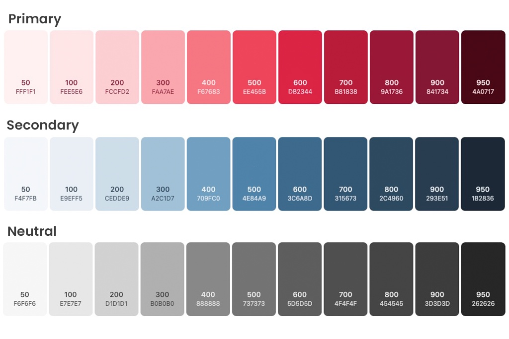

### Fonts
[Back to Top](#table-of-contents)

For this project, I chose the Poppins font. Poppins is a geometric sans-serif font known for its modern and clean appearance. Its sleek lines and readable characters make it a popular choice for digital platforms.

**Why Poppins is a good choice**:

1. **Readability**: Poppins offers excellent readability across different devices and screen sizes, which is crucial for ensuring that the website's content is easily digestible by the audience.
2. **Modern Feel**: Poppins' contemporary and uncluttered look aligns well with the modern and professional aesthetic of the Mindset Makeover website.
3. **Versatility**: Poppins work well in various contexts, from headings and menus to body text, providing a cohesive visual experience throughout the site.
4. **Friendly Appearance**: Despite its clean geometry, Poppins has a friendly quality that makes the website feel approachable and engaging, aligning with the supportive and motivating nature of Mindset Makeover.

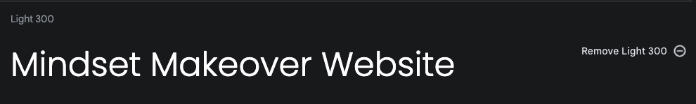
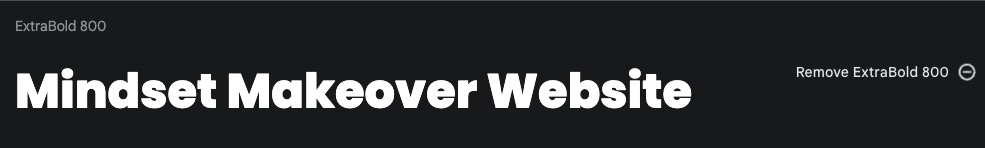

In summary, Poppins enhances the website's visual appeal and supports its functional and emotional objectives, making it an ideal choice for this project.

### Visuals
[Back to Top](#table-of-contents)

#### Logo
[Back to Top](#table-of-contents)

I brainstormed the initial design ideas for the logo using Midjourney, which helped generate a range of creative concepts. I then used Adobe Illustrator to refine my favourite concept into the final design. This process allowed me to create a clear, impactful logo that truly represents the ethos of the brand.

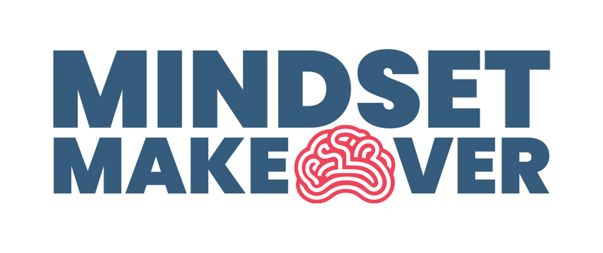

#### Images
[Back to Top](#table-of-contents)

For the specific images needed in the project, like the headshots of Alex Richards, I turned to Midjourney to create the initial versions. These AI-generated images provided a solid starting point. I then used Adobe Photoshop to refine these images further, enhancing their quality to ensure they seamlessly fit the website's overall aesthetic.

#### Icons
[Back to Top](#table-of-contents)

I sketched the website's icons by hand on a tablet. I wanted them to have an organic, hand-drawn look to add a unique and personal touch to the site. After completing the sketches, I digitized and vectorized them using Adobe Illustrator. This approach ensured the icons maintained their organic aesthetic and remained visually sharp and effective.

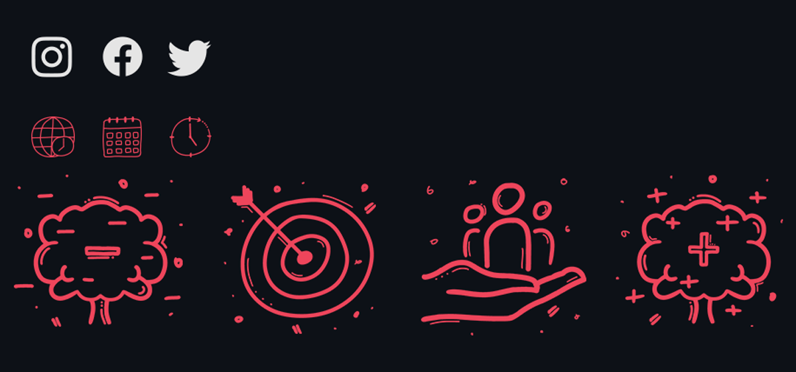

## Pages and Features
[Back to Top](#table-of-contents)

### Website Header Design
[Back to Top](#table-of-contents)

I designed the header to blend a classic layout with interactive elements, creating an experience that's both user-friendly and visually appealing.

I designed the header following a standard pattern, with the logo on the left for brand recognition and the navigation menu on the right for a balanced and intuitive layout.

For each menu item, I included an active page indicator, shown as a light red dot, to give a clear visual cue of the user's current location on the site.

I added a hover effect where the underline beneath the menu items expands from left to right. This animation provides lively feedback as users interact with the menu, enhancing their overall experience.

On mobile devices, I replaced the standard menu with a hamburger icon to better suit smaller screens and improve user interaction.

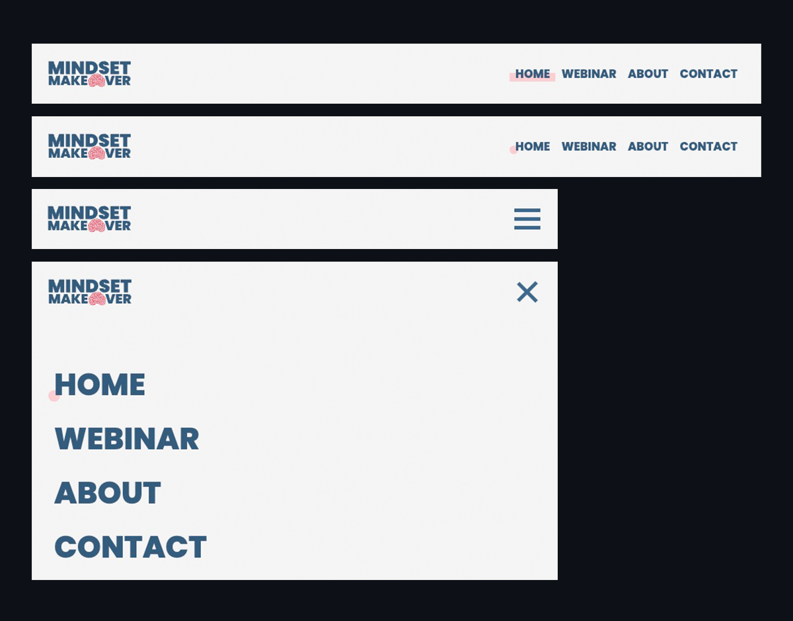

### Website Footer Design
[Back to Top](#table-of-contents)

In my design for the website's footer, I aimed for simplicity and clarity to enhance the user experience.

**Footer Content and Layout**:

- I split the footer into two sections: on the left are secondary links like Terms and Conditions, Privacy Policy, and Contact; on the right are links to our social media profiles.
- For mobile users, I made these links stack in a centered column format, making them easy to navigate.
- I chose a dark blue background for this section to subtly contrast with the main content, with the links in light red for a splash of colour and better visibility.

**Colour Scheme**:

- The dark blue background of the footer contrasts with the light red links, ensuring they are easy to read and visually appealing.
- The copyright section is in a dark gray, almost black, offering a clear distinction from the main footer section, with light text for a sharp contrast.

**Newsletter Signup Form**:

- In the footer of the Home and About pages, I added a newsletter signup form, an important feature for engaging users.
- The form has a slightly lighter blue background than the rest of the footer, with white text, making it stand out and inviting users to subscribe.
- I left this form off other pages like Webinar and Contact to keep the user's focus on specific actions, like signing up for the webinar.

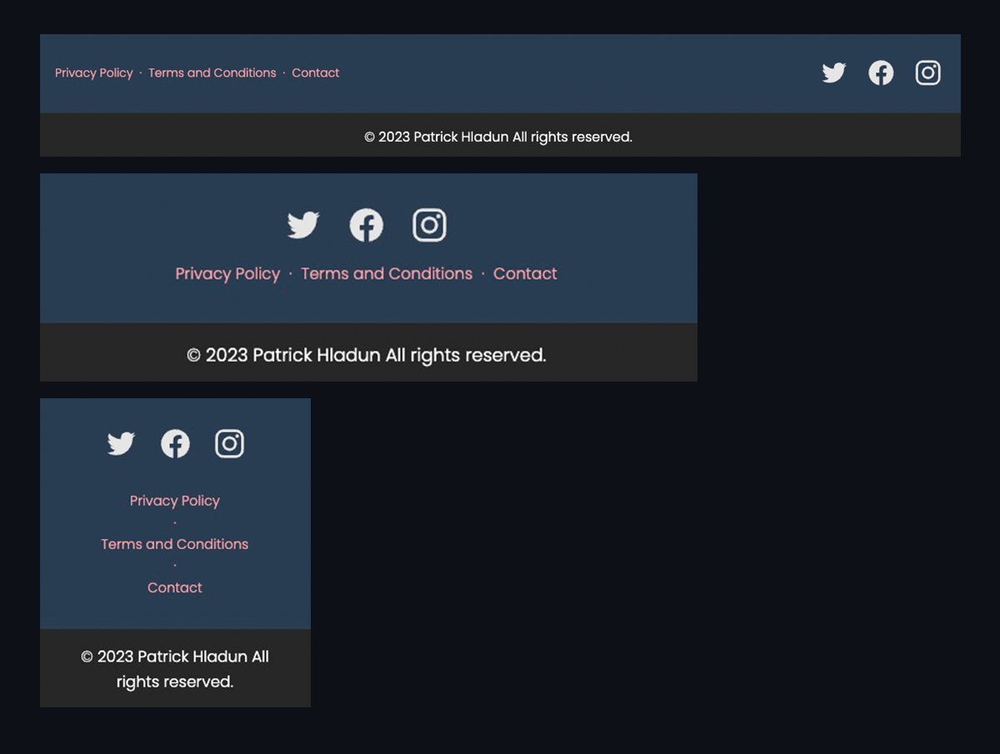

### Home Page
[Back to Top](#table-of-contents)

In the Mindset Makeover website project, each section of the home page was designed for optimal engagement and clarity.

The hero section begins with a compelling statement, "Rewire your mind, transform your life," introducing visitors to the concept of personal transformation through Alex's story. This area is set against a light grey background, complemented by a smooth SVG divider that seamlessly transitions to the next part.

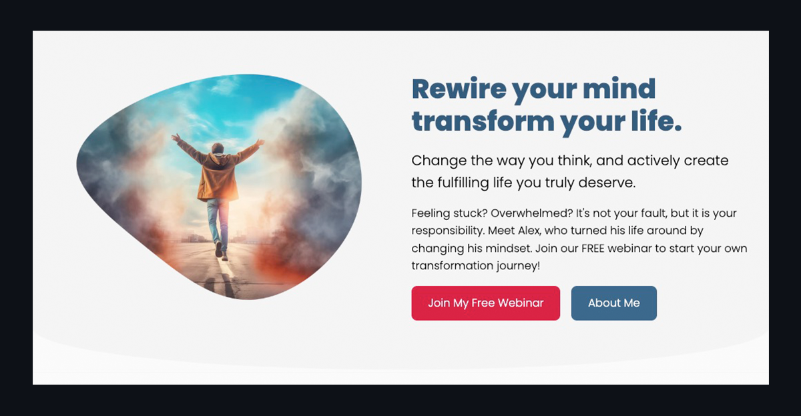

The webinar details section emphasizes the role of mindset in achieving life goals, presenting this through visually engaging icon-text elements that cover themes like positive thinking and goal-setting.

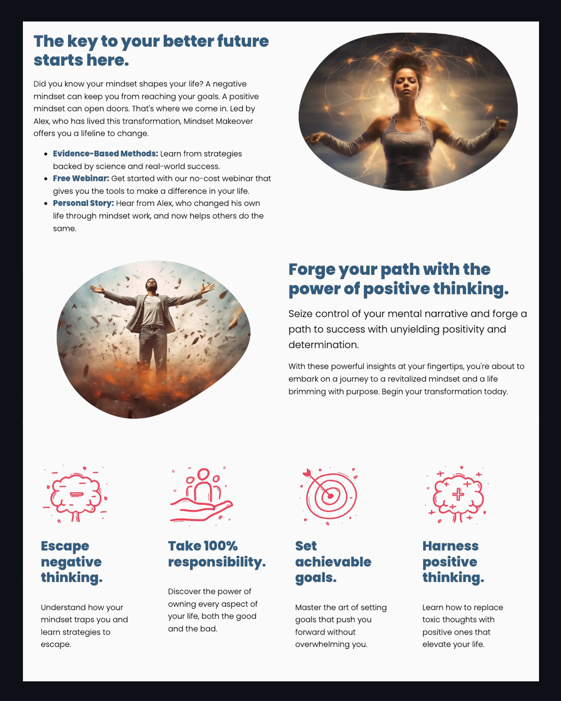

In the 'About Alex' section, the narrative focuses on his journey of overcoming life's hurdles, structured for readability and emotional connection with the audience.

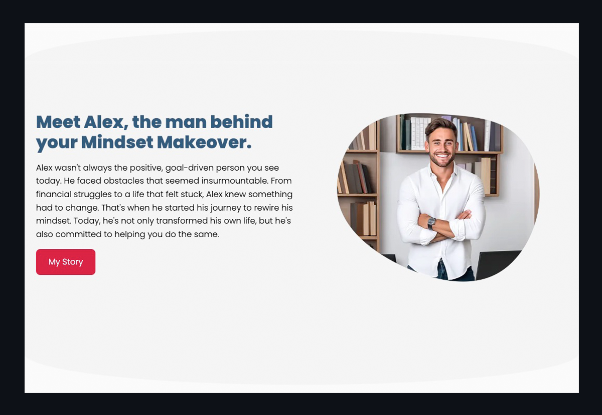

Following this, a standout call-to-action for the webinar sign-up is strategically placed to attract attention, leading visitors towards participation. 

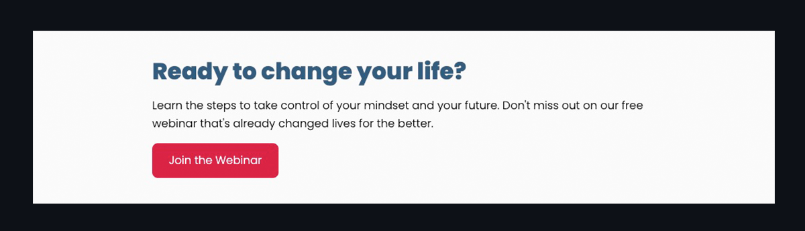

The page concludes with a newsletter signup section, distinct in design yet cohesive with the page's overall aesthetic.

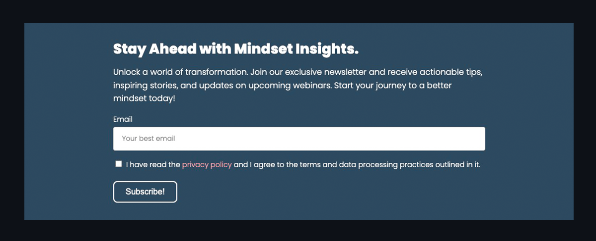

Home page desktop and mobile screenshot

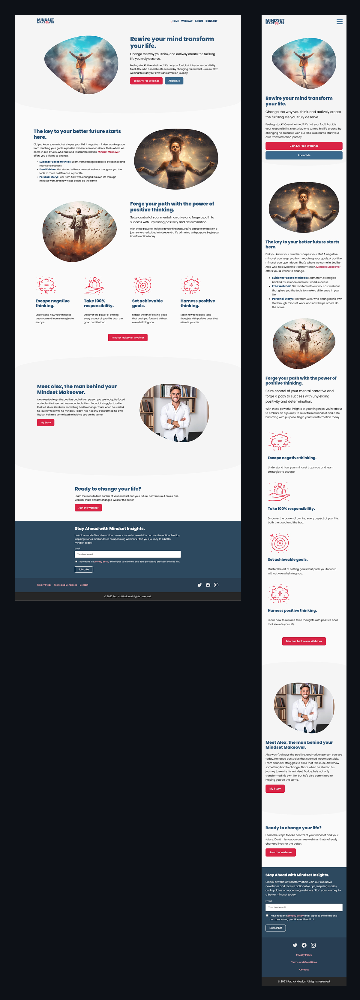

### Webinar Page
[Back to Top](#table-of-contents)

In the Mindset Makeover website project, the Webinar Page is structured to provide comprehensive information about the webinar in an engaging manner.

Hero section features an inviting heading and introductory text, setting the stage for what the webinar offers. I've included a custom video teaser that adheres to the site's colour scheme, providing a visual and engaging preview of the webinar.

Between the hero and the next sections, I have added three boxes with details about the webinar, each accompanied by custom icons. 

The agenda is laid out in a straightforward manner, with simple text. This section breaks down the webinar's content, making it easy for visitors to understand what topics will be covered.

A brief section about Alex, the webinar host, includes a photo. This part is concise, offering a quick introduction to Alex and his credentials.

The FAQs are presented in a two-column list, addressing common questions and concerns about the webinar. This format makes it easy for visitors to find answers quickly.

Three testimonials are included to provide insights from previous participants, adding credibility and a personal touch to the webinar.

The page concludes with a webinar signup section, placed before the footer. This final call-to-action is designed to encourage visitors to register for the webinar.

Overall, the Webinar Page of this project is crafted to inform and motivate visitors, guiding them through the details and leading them towards signing up for the webinar.

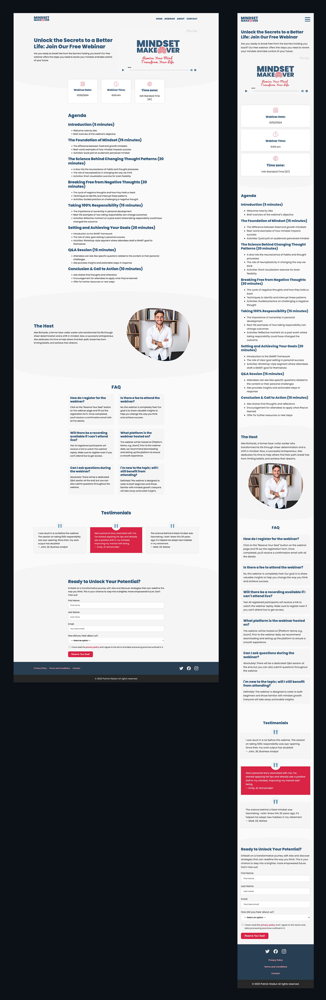

### About Page
[Back to Top](#table-of-contents)

In the Mindset Makeover website project, the About page is created with simplicity and clarity in mind, focusing on introducing Alex and the webinar.

The hero section features a brief introduction about Alex, accompanied by his photo. This instantly gives visitors a personal insight into the coach behind the Mindset Makeover.

Following the hero section is a text-based area dedicated to detailing the webinar. This section methodically explains what the webinar entails, its benefits, and how it aligns with Alex's approach to personal development.

The page concludes with a "Learn More about Webinar" button. This direct call-to-action is strategically placed to encourage visitors to explore further and potentially sign up for the webinar. The section ends with a "Learn More about Webinar" button, inviting visitors to discover more about the webinar offering.

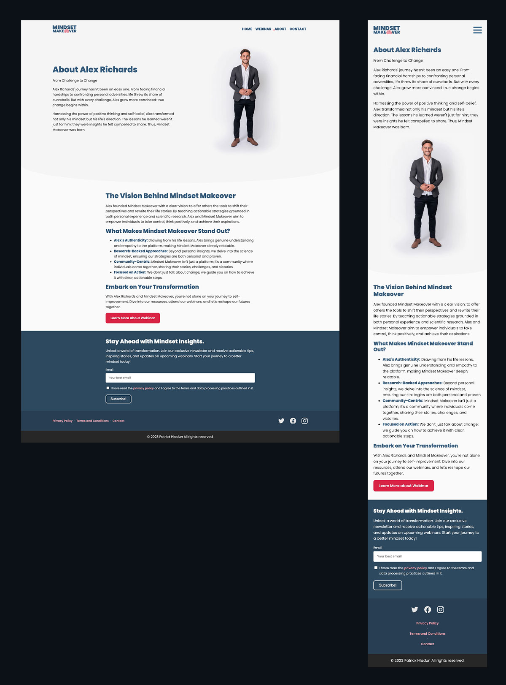

### Contact Page
[Back to Top](#table-of-contents)

In the Mindset Makeover project, the Contact page is straightforward, featuring a brief intro and a simple contact form for easy communication.

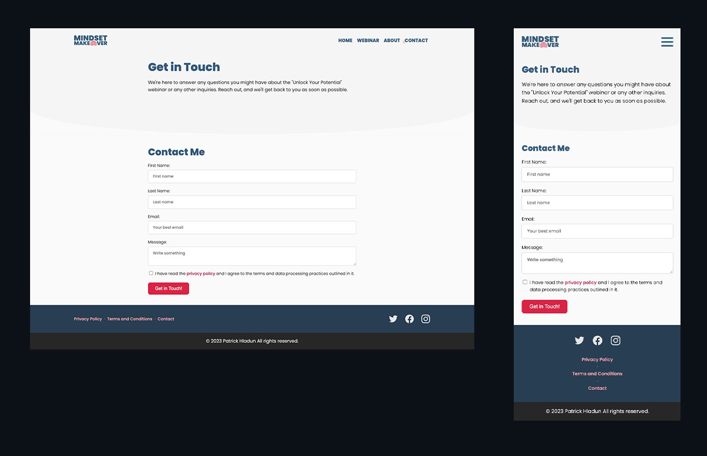

### Thank you pages
[Back to Top](#table-of-contents)

I created three different thank you pages tailored to specific actions: contact form submission, newsletter signup, and webinar signup. Each page provides a customized thank you message relevant to the action taken, ensuring a personalized and appreciative response for every form submission.

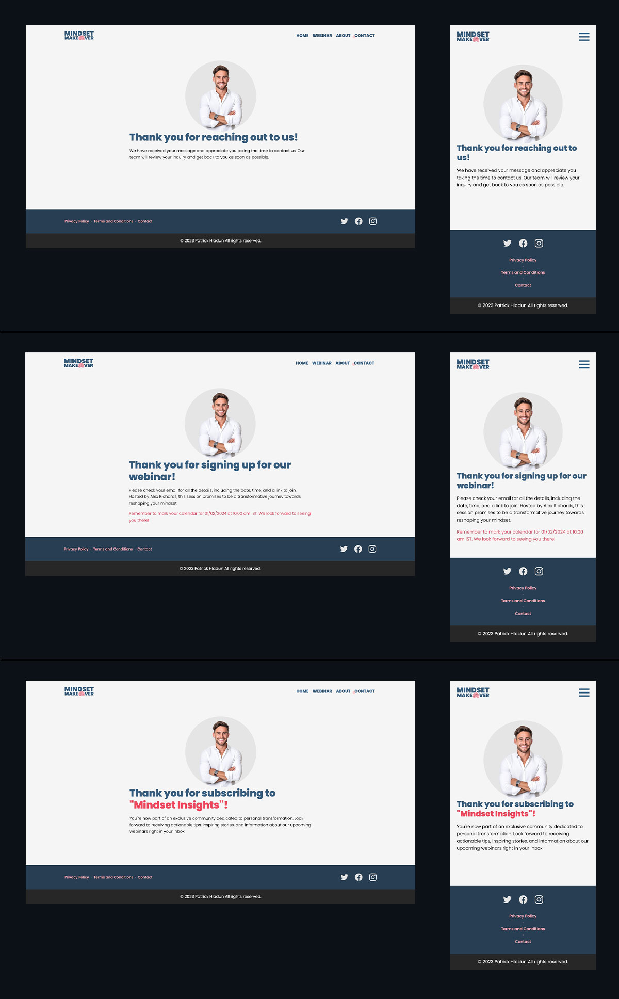

### 404 Page
[Back to Top](#table-of-contents)

In the Mindset Makeover project, I created a custom 404 page with a fun twist. Using a brain illustration generated by DALL-E and edited in Photoshop, the page features a playful error message and a link to return to the home page, ensuring visitors can easily navigate back.

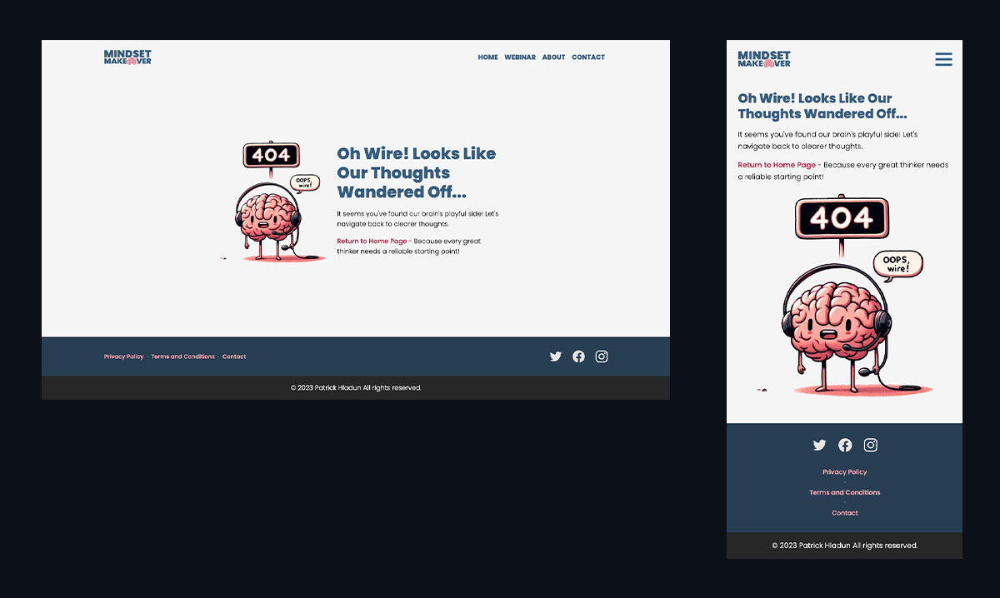

### Legal Pages
[Back to Top](#table-of-contents)

I also included Privacy Policy and Terms and Conditions pages with example content. This ensures legal compliance for the site, especially as it collects user data, and allows linking to privacy details directly from forms' consent checkboxes.

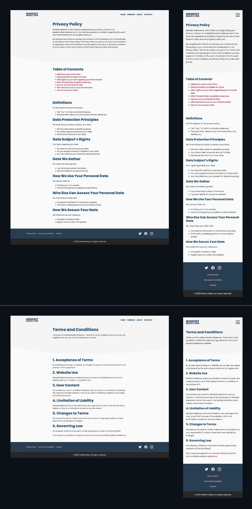

## Technology used
[Back to Top](#table-of-contents)

- **HTML and CSS**: The core of the project, these languages were used to structure and style the website.
- **VSCode**: I chose VSCode as my (IDE) for its efficiency and ease of use.
- **Git and GitHub**: I used Git for version control, allowing me to track and manage changes in the code. I hosted the project on GitHub and deployed it to GitHub Pages from there.
- **Figma**: Figma played a pivotal role in my design process. I used it to create both mobile and desktop wireframes.
- **ChatGPT and Grammarly**: I utilized ChatGPT to brainstorm ideas, create content, and refine the website's text. Grammarly helped me ensure the content's clarity and plagiarism-free nature.
- **DALL-E and Midjourney**: For logo ideas, I turned to DALL-E, and I used Midjourney for imaginative photos of Alex and other website imagery.
- **Procreate and Adobe Illustrator**: I initially drew the icons for the site in Procreate and then vectorized them in Adobe Illustrator to ensure high-quality and scalable graphics.
- **Adobe Photoshop**: Adobe Photoshop was my primary tool for editing and optimizing the generated graphics and exporting image files in the appropriate formats for web use.

:speech_balloon: ChatGPT was not used to generate a single line of code

## Development and Deployment
[Back to Top](#table-of-contents)

To code the project, I used VSCode locally and Git to push commits to the GitHub repository.

The live website was deployed to GitHub Pages. You can access the deployed Mindset Makeover website ['Mindset Makeover website here'](https://patrickhladun.github.io/mindset-makeover/).

Here are the steps taken to deploy Mindset Makeover:

1. Select the repository from the repository list.
2. Go to the 'Settings' tab.
3. In the sidebar menu, navigate to 'Pages.'
4. Select 'Deploy from a branch' and choose the desired branch.
5. Click 'Save.'
6. The link to access the deployed page will be displayed at the top of the page.

## Issues
[Back to Top](#table-of-contents)

### Unresolved Issues
[Back to Top](#table-of-contents)

- [Issue #1 - Webinar Page: back/forward cache restoration](https://github.com/patrickhladun/mindset-makeover/issues/1)
- [Issue #2 - Privacy Policy Page: Tap targets are not sized appropriately, 54% appropriately sized tap targets](https://github.com/patrickhladun/mindset-makeover/issues/2)

### Resolved Issues
[Back to Top](#table-of-contents)

1. **Navigation Functionality**
- **Problem:** Initially, I used the `has()` CSS selector to trigger the opening of the mobile navigation when the menu button was clicked. However, this approach presented an issue when it came to CSS validation. The `has()` selector did not comply with CSS validation standards, and finding a suitable solution proved challenging at the time.
- **Solution:** To resolve this issue, I undertook a refactor of the header, using the solution implemented in the Love Running project. This new approach ensured proper navigation functionality while passing the CSS validation.      

2. **Image Masking**
- **Problem:** Originally, I used CSS masking techniques to apply SVG blob shapes to images. However, this approach led to validation warnings, primarily due to the usage of -webkit prefixes.
- **Solution:** To fix these issues, I decided to abandon the use of -webkit prefixes. I used the blob shapes in Photoshop to mask images and exported them as webp files with transparent backgrounds. This alternative approach achieved the same visual results while reducing the complexity of the code and clearing the warnings.

3. **Icon Handling**
- **Issue:** Using CSS masks with SVG images for icon colour switching led to warnings due to -webkit prefixes similar to the issues encountered with the image blobs.
- **Solution:** I replaced CSS masks with inline SVGs. This change cleared the warnings and simplified the CSS, resulting in a cleaner and more compliant codebase.

## Testing and Validation
[Back to Top](#table-of-contents)

Website was tested manually using chrome developer tools breakpoints but also with physical devicaes like laptop tablet and a smartphone.

I have checked all links correctly in the main navigation, secondary links and other links in text and forms.

### Functional testing
[Back to Top](#table-of-contents)

#### Website Header on Desktop
[Back to Top](#table-of-contents)

|Test scenario|Steps to Reproduce|Observation|Outcome|
|-------------|------------------|-----------|-------|
|||||
|Navigation links|Click on the menu links: home, webinar, about, contact.|Navigation links should lead to their respective pages.|All links correctly navigate to their designated pages.|
|Navigation links hover state|Hover over the menu links.|While hovering, the menu item underline should animate from left to right.|The hover state is working correctly.|
|Navigation active state|Click on the menu links: home, webinar, about, contact.|When a menu link is clicked and the page is opened, a red dot should appear in the bottom left of the link, indicating that the page is active.|Active state is working correctly.|

#### Website Header on Mobile
[Back to Top](#table-of-contents)

|Test scenario|Steps to Reproduce|Observation|Outcome|
|-------------|------------------|-----------|-------|
|||||
|Navigation toggle button|Click mobile menu toggle.|When clicked, the hamburger menu should change to a close button.|Toggle button works as expected.|
|Mobile menu|Click mobile menu toggle.|Mobile menu should open and reveal website links.|Mobile menu opens as expected.|

#### Website Footer
[Back to Top](#table-of-contents)

|Test scenario|Steps to Reproduce|Observation|Outcome|
|-------------|------------------|-----------|-------|
|||||
|Social media links|Click on social links: twitter, facebook, instagram.|Social links should lead to their respective pages and open in a new tab.|All social links open in new browser tabs, and the correct social page is opened.|
|Social media links hover state|Hover over the social links.|Icons should change color on hover.|Icons correctly change color on hover.|
|Secondary links|Click on the menu links: Privacy Policy, Terms and Conditions, and Contact.|Secondary links should lead to their respective pages.|All links correctly navigate to their designated pages.|
|Secondary links hover state|Hover over the menu links.|While hovering, the menu item underline should animate from left to right.|The hover state is working correctly.|

#### Home Page
[Back to Top](#table-of-contents)

|Test scenario|Steps to Reproduce|Observation|Outcome|
|-------------|------------------|-----------|-------|
|||||
|Page buttons|Click on buttons: "Join my free webinar," "About me," "My story," and "Join the webinar."|Buttons should lead to their respective pages.|All buttons correctly navigate to their designated pages.|
|Newsletter form|Fill in the email field, check consent checkbox, and submit the form.|Form should be submitted, and the user should be redirected to the thank you page.|Form is submitted correctly, and the user is redirected to the thank you page.|
|Newsletter consent Privacy Policy link|Click on Privacy Policy link.|Clicked link should open the Privacy Policy page in a new tab so the user does not lose filled fields.|Privacy Policy link opens Privacy Policy page in a new tab.|
|Newsletter form error handling|Submit the form with an incorrect email.|Validation error should appear on the email field.|Error is displayed, and the form cannot be submitted.|
|Newsletter form error handling|Submit the form without checking the consent checkbox.|Validation error should appear on the consent field.|"Please tick this box ..." error is shown, and the form cannot be submitted.|

#### Webinar Page
[Back to Top](#table-of-contents)

|Test scenario|Steps to Reproduce|Observation|Outcome|
|-------------|------------------|-----------|-------|
|||||
|Teaser video|Video navigation: Play the video, pause the video, mute the video.|All video player navigation and options should work without an issue.|All video player buttons work as expected.|
|Mindset registration form submission|1. Fill in the form fields: First Name, Last Name, Email, How did you hear about us? And consent.  2. Submit the form.|Form should be submitted, and the user should be redirected to the relevant thank you page.|Form is submitted correctly, and the user is redirected to the thank you page.|
|Mindset registration form consent Privacy Policy link|Click on Privacy Policy link.|Clicked link should open the Privacy Policy page in a new tab so the user does not lose filled fields.|Privacy Policy link opens Privacy Policy page in a new tab.|
|Mindset registration form error handling|Submit the form with an incorrect email address.|Validation error should appear on the email field.|Error is displayed, and the form cannot be submitted.|
|Mindset registration form error handling|Submit the form omitting any of the text field or select field.|All fields are mandatory. Validation error should appear on the omitted field.|Error is displayed on the omitted field, and the form cannot be submitted.|
|Mindset registration form error handling|Submit the form without checking the consent checkbox.|Validation error should appear on the consent field.|"Please tick this box ..." error is shown, and the form cannot be submitted.|

#### About Page
[Back to Top](#table-of-contents)

|Test scenario|Steps to Reproduce|Observation|Outcome|
|-------------|------------------|-----------|-------|
|||||
|Page button|Click on button: "Learn more about webinar."|Clicked button should lead to the webinar page.|Button correctly navigate to the webinar pages.|

#### Contact Page
[Back to Top](#table-of-contents)

|Test scenario|Steps to Reproduce|Observation|Outcome|
|----------------|-------------------|------------|--------|
|||||
|Contact form submission|1.Fill in the form fields: First Name, Last Name, Email, Message And consent. 2.Submit the form|Form should be submitted, and the user should be redirected to the relevant thank you page|Form is submitted correctly, and the user is redirected to the thank you page.|
|Contact form consent Privacy Policy link|Click on Privacy Policy link|Clicked link should open the Privacy Policy page in a new tab so the user does not lose filled fields|Privacy Policy link opens Privacy Policy page in a new tab.|
|Contact form error handling|Submit the form with not correct email address|Validation error should appear on the email field|Error is displayed and form cannot be submitted|
|Contact form error handling|Submit the form omitting any of the text or textarea fields|All fields are mandatory. Validation error should appear on the omitted field|Error is displayed on omitted field and form cannot be submitted|
|Contact form error handling|Submit the form without checking consent checkbox|Validation error should appear on the consent field|"Please tick this box ..." error is showing and form cannot be submitted|

#### Contact Page
[Back to Top](#table-of-contents)

|Test scenario|Steps to Reproduce|Observation|Outcome|
|----------------|-------------------|------------|--------|
|||||
|Content anchor links|Click on the table of contents link|User should be taken to the relevant section after clicking the link|All Table of Contents links scroll to the correct sections|

#### Thank You and 404 Error Pages
[Back to Top](#table-of-contents)

|Test scenario|Steps to Reproduce|Observation|Outcome|
|-------------|------------------|-----------|-------|
|||||
|Contact Thank You Page|Click on the "Learn More about the Webinar" button.|The user should be redirected to the webinar page.|All buttons correctly navigate to their designated pages.|
|Newsletter Thank You Page|Click on the "Learn More about the Webinar" button.|The user should be redirected to the webinar page.|The button works as expected.|
|Webinar Thank You Page|Click on the "Back to Home Page" button.|The user should be redirected to the homepage.|The button works as expected.|
|404 Error Page|Click on the "Return to Home Page" link.|The user should be redirected to the homepage.|The link works as expected.|

### Google Page Insights Tests:
[Back to Top](#table-of-contents)

- [Home Page](https://pagespeed.web.dev/analysis/https-patrickhladun-github-io-mindset-makeover/mgltjqe8is?form_factor=mobile)
- [Webinar Page](https://pagespeed.web.dev/analysis/https-patrickhladun-github-io-mindset-makeover-webinar-html/748a0ntli1?form_factor=mobile)
- [About Page](https://pagespeed.web.dev/analysis/https-patrickhladun-github-io-mindset-makeover-about-html/ds102hszm5?form_factor=mobile)
- [Contact Page](https://pagespeed.web.dev/analysis/https-patrickhladun-github-io-mindset-makeover-contact-html/69423su0iq?form_factor=mobile)
- [Privacy Policy Page](https://pagespeed.web.dev/analysis/https-patrickhladun-github-io-mindset-makeover-privacy-policy-html/txveq8h09s?form_factor=mobile)
- [Terms and Conditions Page](https://pagespeed.web.dev/analysis/https-patrickhladun-github-io-mindset-makeover-terms-html/og2lnt2167?form_factor=mobile)
- [Contact Submission Thank You Page](https://pagespeed.web.dev/analysis/https-patrickhladun-github-io-mindset-makeover-thank-you-contact-html/1127kffl74?form_factor=mobile)
- [Webinar Submission Thank You Page](https://pagespeed.web.dev/analysis/https-patrickhladun-github-io-mindset-makeover-thank-you-webinar-html/6r25jchddy?form_factor=mobile)
- [Newsletter Submission Thank You Page](https://pagespeed.web.dev/analysis/https-patrickhladun-github-io-mindset-makeover-thank-you-newsletter-html/5v71nvx3so?form_factor=mobile)
- [404 Error Page](https://pagespeed.web.dev/analysis/https-patrickhladun-github-io-mindset-makeover-404-html/sb5nbb9x5a?form_factor=mobile)

#### Home Page
[Back to Top](#table-of-contents)

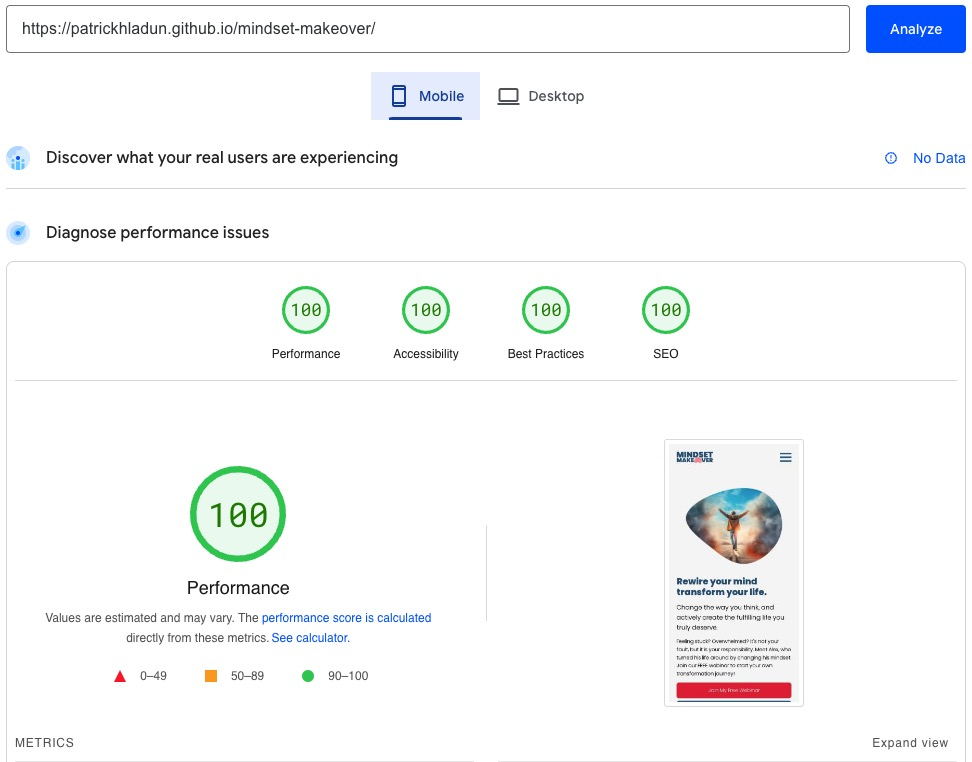

#### Webinar Page
[Back to Top](#table-of-contents)

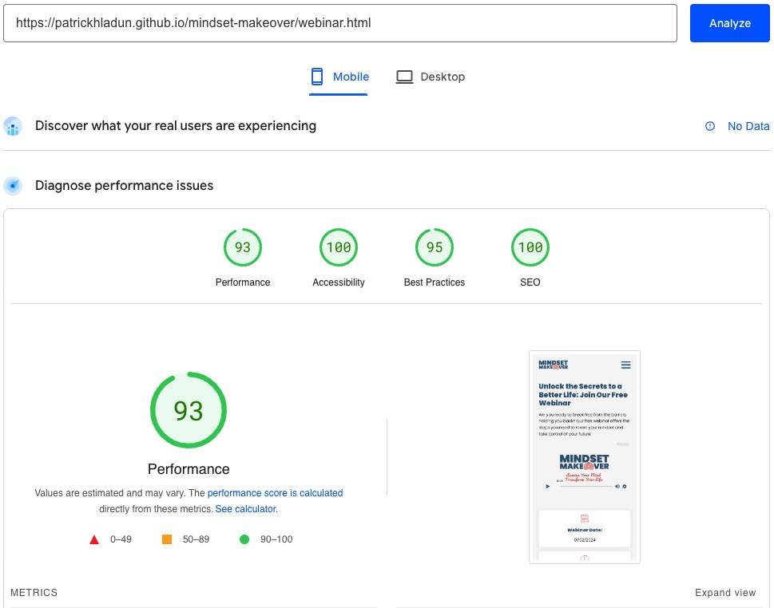

#### About Page
[Back to Top](#table-of-contents)

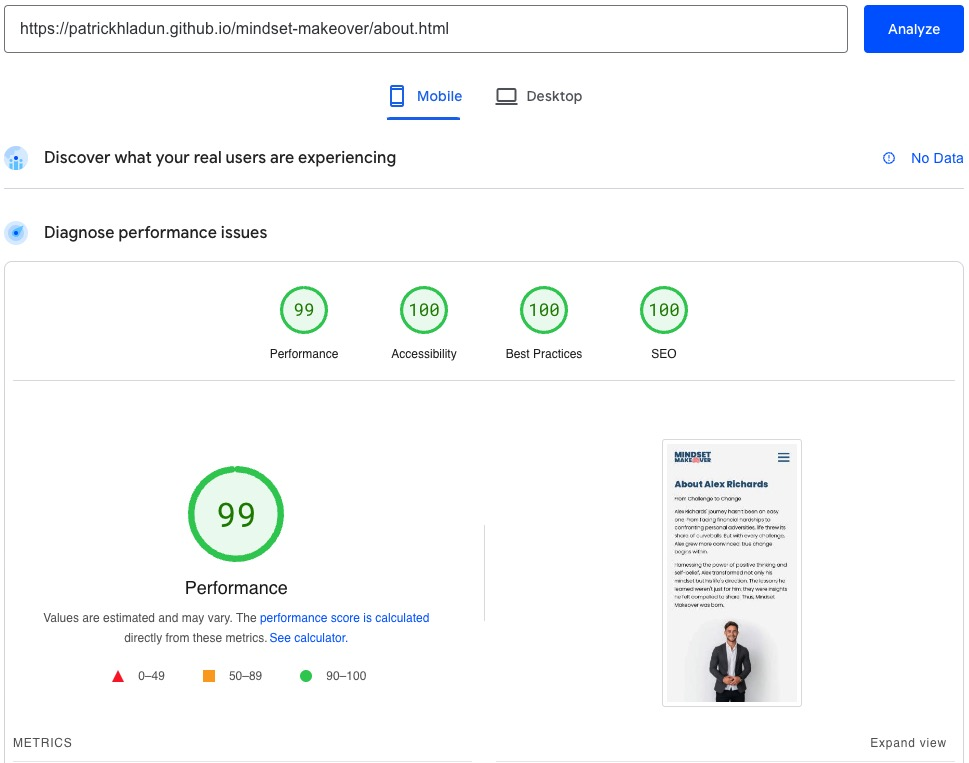

#### Contact Page
[Back to Top](#table-of-contents)

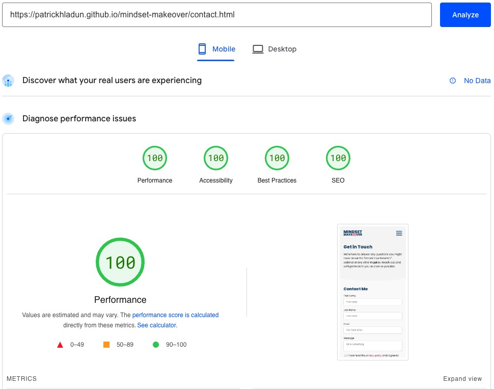

#### Thank You Contact Page
[Back to Top](#table-of-contents)

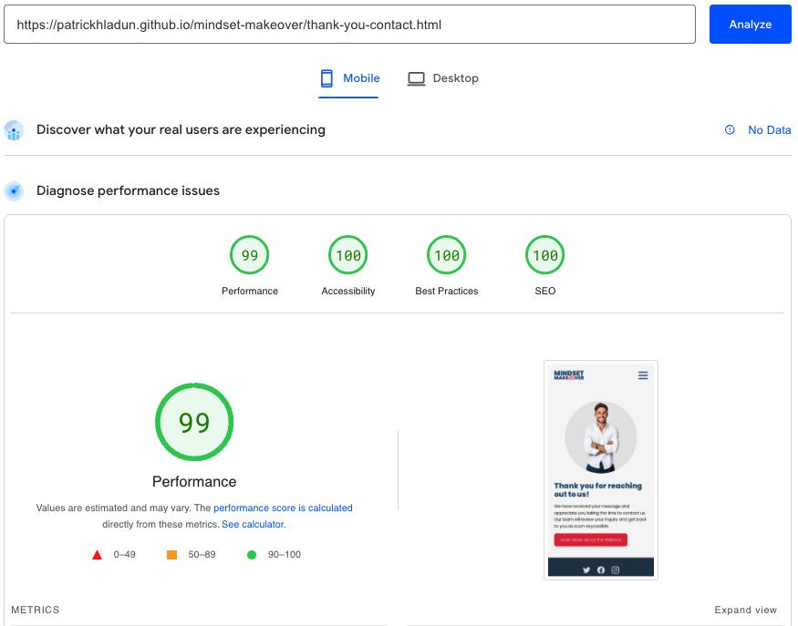

#### Thank You Webinar Page
[Back to Top](#table-of-contents)

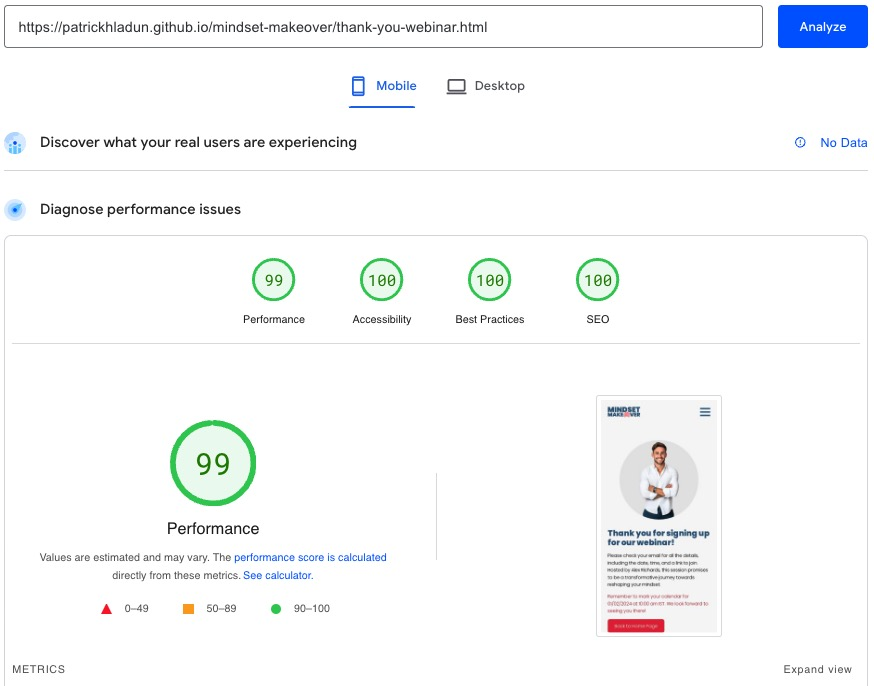

#### Thank You Newsletter Page
[Back to Top](#table-of-contents)

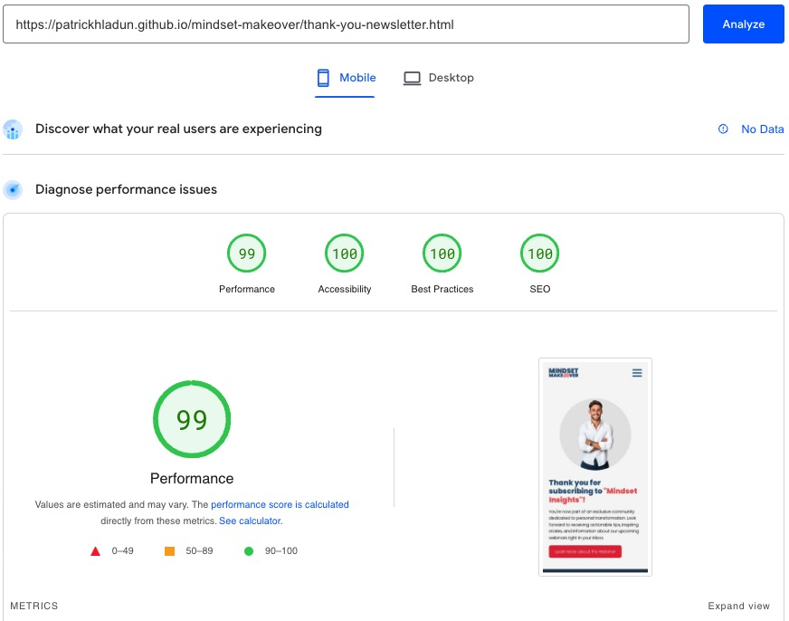

#### 404 Error Page
[Back to Top](#table-of-contents)

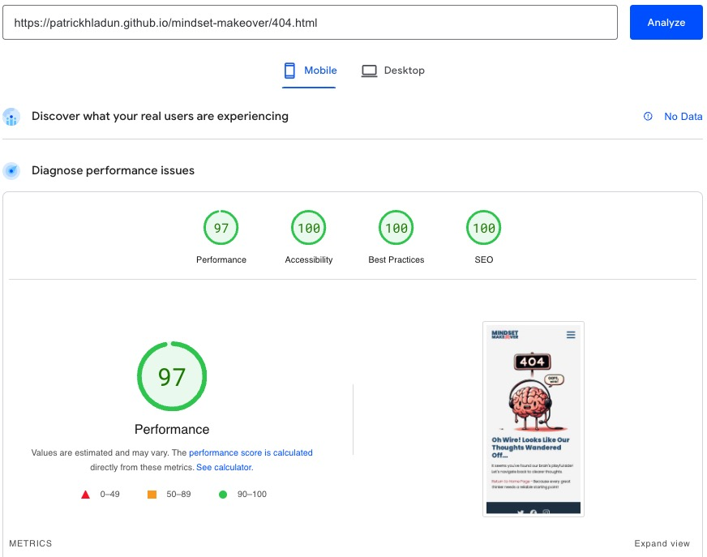

### HTML Validation
[Back to Top](#table-of-contents)

I conducted HTML validation using the W3C Markup Validation Service for all the pages of the website. There were no errors or warnings found on any of the pages.

Page Validation Links:
- [Home Page](https://validator.w3.org/nu/?doc=https%3A%2F%2Fpatrickhladun.github.io%2Fmindset-makeover%2F)
- [Webinar Page](https://validator.w3.org/nu/?doc=https%3A%2F%2Fpatrickhladun.github.io%2Fmindset-makeover%2Fwebinar.html)
- [About Page](https://validator.w3.org/nu/?doc=https%3A%2F%2Fpatrickhladun.github.io%2Fmindset-makeover%2Fabout.html)
- [Contact Page](https://validator.w3.org/nu/?doc=https%3A%2F%2Fpatrickhladun.github.io%2Fmindset-makeover%2Fcontact.html)
- [Privacy Policy Page](https://validator.w3.org/nu/?doc=https%3A%2F%2Fpatrickhladun.github.io%2Fmindset-makeover%2Fprivacy-policy.html)
- [Terms and Conditions Page](https://validator.w3.org/nu/?doc=https%3A%2F%2Fpatrickhladun.github.io%2Fmindset-makeover%2Fterms.html)
- [Contact Submission Thank You Page](https://validator.w3.org/nu/?doc=https%3A%2F%2Fpatrickhladun.github.io%2Fmindset-makeover%2Fthank-you-contact.html)
- [Webinar Submission Thank You Page](https://validator.w3.org/nu/?doc=https%3A%2F%2Fpatrickhladun.github.io%2Fmindset-makeover%2Fthank-you-webinar.html)
- [Newsletter Submission Thank You Page](https://patrickhladun.github.io/mindset-makeover/thank-you-newsletter.html)
- [404 Error Page](https://validator.w3.org/nu/?doc=https%3A%2F%2Fpatrickhladun.github.io%2Fmindset-makeover%2F404.html)

### CSS Validation
[Back to Top](#table-of-contents)

I also validated the CSS on validator.w3.org, and it passed successfully, except for one warning. This warning was triggered by the use of CSS variables and included the message: 'Due to their dynamic nature, CSS variables are not subject to static checking.

[W3C CSS Validation Results](https://jigsaw.w3.org/css-validator/validator?uri=https%3A%2F%2Fpatrickhladun.github.io%2Fmindset-makeover%2F&profile=css3svg&usermedium=all&warning=1&vextwarning=&lang=en)

## Further Improvements
[Back to Top](#table-of-contents)

For further enhancements to the Mindset Makeover project, considering Alex's role as a coach, there are several potential features and services that could significantly enrich the website:

- Alex could offer personalized 1-to-1 coaching sessions, focusing on various aspects of personal and professional development. Specific services could include job interview preparation, confidence-building workshops, and career advancement coaching.
- A blog section would be a valuable addition, providing articles on self-improvement, success stories, and book recommendations.
- Launching a podcast could attract a wider audience. This platform could feature interviews with inspiring personalities, discussions on personal growth strategies, and insights from Alex himself.
- If Alex is a book author, a section dedicated to his publications would be an excellent addition. This could showcase his books, provide summaries, and link to purchase options.

## Credits
[Back to Top](#table-of-contents)

- [Safari browser mockup by sashalazar](https://sashalazar.gumroad.com/l/mqxFJ)
- [Mobile Phone Mockup by Antony Boyd](https://www.anthonyboyd.graphics/mockups/iphone-14-pro-max-mockup/)

## Acknowledgments
[Back to Top](#table-of-contents)

- :point_right: Thanks to my CI Mentor [Luke Buchanan](https://www.linkedin.com/in/lukebuchanan67/) for giving me valuable feedback, tips and help to find some areas of improvement.
- :point_right: [Kera Cudmore](https://www.linkedin.com/in/keracudmore/) for great repo about README.md file where I learned about shields.io badges