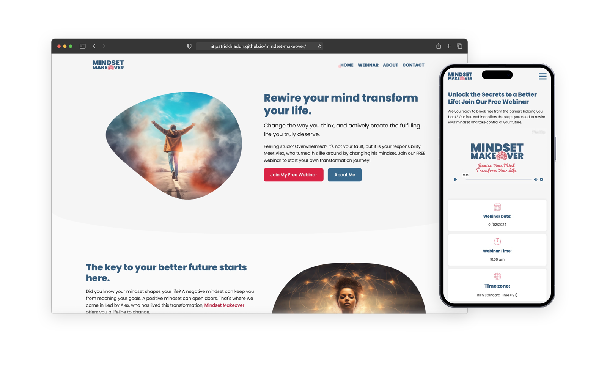
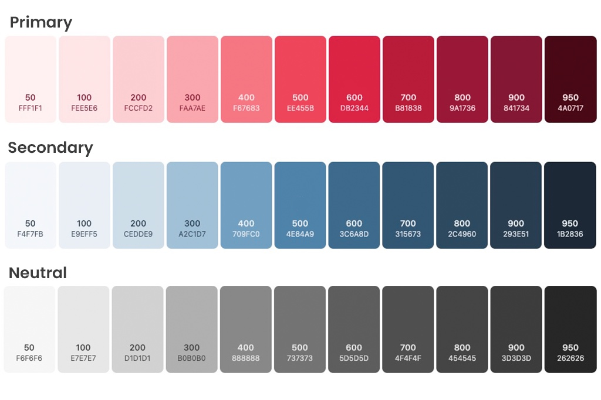

# Mindset Makeover Website - CI Project 1

**Mindset Makeover** is a made-up personal coaching website. It's part of a project for the Code Institute Diploma in Full-Stack Software Development. The main character of this project is Alex Richards. He's like a personal coach. His life story is full of challenges. But he chose to change his life. He did this by transforming how he thinks and deals with problems. This significant change helped him a lot. So, he started Mindset Makeover. This website is for assisting people to change their life stories like he did.

[Mindset Makeover Deployed Website](https://patrickhladun.github.io/mindset-makeover/webinar.html)

## Planning
### Project Scope and Objectives
Mindset Makeover is a personal coaching website. I have designed it to be simple and user-friendly. This project includes a home page, a place for signing up for newsletters, information about webinars, and a form to register for these webinars. There's also a contact page for questions or support.

#### Mindset Makeover Website Objectives

1. **Educational Engagement**: I aim to provide content that helps visitors understand the importance of a positive mindset in their personal and professional lives.
2. **User Interaction**: I aim to engage users by offering newsletter sign-ups and webinar registrations, providing practical advice and inspiring stories.
3. **Brand Awareness**: I'm focusing on establishing Mindset Makeover as a known resource for personal development. Community building is beyond this project's scope, but I might add this later.
4. **User Conversion**: I want to encourage visitors to participate actively, especially in the free webinars Alex Richards hosts, where they can learn about positive thinking and self-empowerment.
#### Key components of the website include:

- **Home page**: Introduces the mission of Mindset Makeover.
- **About page**: Detailing Alex Richards’ journey and the philosophy behind Mindset Makeover.
- **Webinar registration page**: Details about the upcoming webinar and a place for users to sign up for webinars.
- **Contact page**: For user inquiries and support.

In the future, I might add a blog, a podcast, and other elements to the website. For now, my focus is on offering a streamlined and valuable experience.

The ultimate purpose of the website is to not only deliver information but also to inspire users to take steps towards enhancing their lives. The project will focus on delivering a seamless user experience with high-quality content, thereby fostering a positive community and brand loyalty.
## User Experience
### Audience Persona: Emily O'Sullivan
- **Age**: 35
- **Gender**: Female
- **Location**: Suburban area near Dublin, Ireland
- **Occupation**: Middle-level Manager in a Tech Company
- **Education**: Bachelor’s Degree in Business Management
- **Marital Status**: Married with two children

#### Psychographics:
- **Interests**: Personal development, engaging in local community workshops, mindfulness retreats, reading self-help books, and exploring outdoor activities in Ireland.
- **Goals**: Striving to balance a demanding career with family life, aspiring to lead her team more effectively while nurturing a healthy home environment.
- **Challenges**: Facing stress from juggling professional responsibilities and parenting, combating self-doubt, and seeking ways to remain positive amidst work-life pressures.

#### Behavioral Traits:
- Actively seeks out resources for self-improvement and professional growth.
- Spends evenings browsing websites for articles and videos on leadership, personal development, and stress management.
- Participates in local community groups and online forums discussing career advancement and work-life balance.

#### Online Habits:
- Regularly uses social media platforms like LinkedIn for professional growth and Facebook for connecting with local community groups.
- Enjoys subscribing to newsletters focused on personal development and leadership skills.
- Prefers engaging with interactive online content, such as live webinars and virtual workshops, that offer real-time learning and interaction.

#### How Mindset Makeover Meets Emily's Needs:
- Mindset Makeover's webinars offer Emily practical and actionable advice to improve her leadership skills and manage stress, aligning with her goal to balance her professional and personal life.
- The newsletters provide ongoing support and insights, helping her navigate daily challenges with a positive mindset.
### User Goals
1. **Personal Growth and Development**: Users come to the site seeking resources and advice for personal and professional growth. They are looking to improve their mindset and life strategies.
2. **Implementing Practical Strategies**: Visitors are interested in finding actionable techniques that they can apply in their everyday lives. They value practical advice that leads to tangible changes.
3. **Overcoming Personal Challenges**: Many users are dealing with specific personal issues such as stress management, work-life balance, or confidence building. They are looking for support and strategies to overcome these challenges.
4. **Staying Informed with Regular Updates**: Visitors may want to subscribe to newsletters or updates to stay informed about new content, events, or learning resources.
### User Stories
1. **As a busy professional**, I want to find quick, actionable strategies for stress management, so I can improve my work-life balance.
2. **As a recent graduate**, I want to learn how to set and achieve my career goals, so I can navigate my path to success more effectively.
3. **As a team leader**, I want to learn techniques for positive leadership, so I can create a better work environment for my team.
4. **As someone struggling with self-confidence**, I want to find resources for boosting self-esteem, so I can feel more empowered in my personal and professional life.
5. **As a regular webinar attendee**, I want to easily sign up for online events, so I can learn directly from experts like Alex Richards.
6. **As a lifelong learner**, I want to subscribe to a newsletter that provides regular insights and tips on personal growth, so I can continuously improve myself.
7. **As a newcomer to personal development**, I want to understand the basics of mindset change, so I can start making positive changes in my life.
8. **As a tech-savvy user**, I want a website that is easy to navigate on my phone or tablet, so I can access content on-the-go.
9. **As a person looking for professional advice**, I want to contact the Mindset Makeover team easily, so I can get answers to my specific questions.
### Five Planes of UX
#### Strategy
- **User Needs**: The website aims to cater to individuals seeking personal growth and mindset change. Users typically look for inspiration, practical advice, and strategies to overcome personal and professional challenges.
- **Business Objectives**: The primary goal is to establish Mindset Makeover as a leading resource in personal development and coaching. This includes building brand recognition, engaging users through webinars and newsletters, and ultimately creating a platform where users can find valuable, life-changing content.
#### Scope
- **Content Requirements**: The website will feature information about Alex and webinar details.
- **Functionality Requirements**: Key functionalities include a newsletter subscription, webinar registration, a contact form, and responsive navigation.
#### Structure
- **Interaction Design**: The site will be structured to facilitate easy navigation to essential sections like About, Webinar, Blog, and Contact. Interactivity will be smooth and intuitive, ensuring users can easily sign up for newsletters and webinars.
- **Information Architecture**: Content will be organized logically with clear headings and categories. A straightforward menu and clear CTAs (Call to Actions) will guide users through their journey on the site.
#### Skeleton
- **Navigation Design**: A clear and consistent navigation menu will be present on all pages. Key sections will be accessible from the homepage.
- **Interface Design**: The user interface will be clean and uncluttered, with a focus on readability and easy access to information. Important elements like subscription forms and contact details will be prominently displayed.
- **Information Design**: Content will be laid out in an easily digestible format, using headings, bullet points, and images where appropriate.
#### Surface
- **Visual Design**: The website will use a colour palette that inspires positivity. The design will be modern and professional, with a friendly and approachable feel.
- **Typography**: Readable, web-friendly fonts will be used for easy reading across devices.
- **Imagery**: High-quality images that resonate with the theme of personal growth and positivity will be used to engage users visually.
### Wireframes
Creating wireframes was crucial for developing Mindset Makeover. I chose Figma for this task because it's user-friendly and practical. I used real text instead of placeholders in the wireframes, making them more detailed and reflective of the final site.

**Key Aspects of Wireframing**:

- **Layout Visualization**: Using Figma, I was able to quickly visualize the site's layout, ensuring it was easy to navigate.
- **Responsive Design**: I made wireframes for both desktop and mobile devices to guarantee a good user experience on any screen.
- **Real Content Integration**: Including real text in the wireframes gave me a clearer view of the final look and functionality of the site.

Figma was a great help in streamlining my design process, allowing me to focus on the user experience right from the start.

[Desktop and Mobile Figma Wireframes](https://www.figma.com/file/PAUeo3vZSOHDkS8Vv4Trvj/Mindset-Makeover?type=design&node-id=79-1820&mode=design)
## Design
### Colors Scheme
In the design of the Mindset Makeover website, I carefully selected a colour palette of red, blue, and neutral grey to enhance the user experience and visual appeal.

**Red**, as the primary color, is strategically used for main call-to-action buttons, links, and icons. It also serves as a background for testimonials, breaking the visual monotony and drawing attention. This vibrant colour symbolizes energy and action, aligning with the site's objective of motivating personal growth.

**Blue** is utilized for headings, darker background elements, and secondary buttons. Its calm and stable nature complements the red, providing a sense of tranquillity and trust, essential for a personal development website.

Additionally, **neutral grey** plays a subtle but crucial role. It is used for very light backgrounds, offering a clean, modern look that enhances readability. For the copyright section, a darker shade of grey provides a sophisticated contrast, grounding the site's design.

Together, these colours create a balanced and engaging visual experience. The combination of red and blue aligns with the website's core themes, while the grey adds a necessary balance, ensuring the design remains accessible and pleasing to the eye.
### Fonts
For this project, I chose the Poppins font. Poppins is a geometric sans-serif font known for its modern and clean appearance. Its sleek lines and readable characters make it a popular choice for digital platforms.

**Why Poppins is a good choice**:

1. **Readability**: Poppins offers excellent readability across different devices and screen sizes, which is crucial for ensuring that the website's content is easily digestible by the audience.
2. **Modern Feel**: The contemporary and uncluttered look of Poppins aligns well with the modern and professional aesthetic of the Mindset Makeover website.
3. **Versatility**: Poppins works well in various contexts, from headings and menus to body text, providing a cohesive visual experience throughout the site.
4. **Friendly Appearance**: Despite its clean geometry, Poppins has a friendly quality that makes the website feel approachable and engaging, aligning with the supportive and motivating nature of Mindset Makeover.

In summary, Poppins not only enhances the website’s visual appeal but also supports its functional and emotional objectives, making it an ideal choice for this project.
### Visuals
#### Logo
I brainstormed the initial design ideas for the logo using Midjourney, which helped generate a range of creative concepts. I then used Adobe Illustrator to refine my favourite concept into the final design. This process allowed me to create a logo that's clear and impactful and truly represents the ethos of the brand.
#### Images
For the specific images needed in the project, like the headshots of Alex Richards, I turned to Midjourney to create the initial versions. These AI-generated images provided a solid starting point. I then used Adobe Photoshop to refine these images further, enhancing their quality to ensure they seamlessly fit the website's overall aesthetic.
#### Icons
I sketched the website's icons by hand on a tablet. I wanted them to have an organic, hand-drawn look to add a unique and personal touch to the site. After completing the sketches, I digitized and vectorized them using Adobe Illustrator. This approach ensured the icons maintained their organic aesthetic and remained visually sharp and effective.

### Colors Scheme
In the design of the Mindset Makeover website, I carefully selected a colour palette of red, blue, and neutral grey to enhance the user experience and visual appeal.

**Red**, as the primary color, is strategically used for main call-to-action buttons, links, and icons. It also serves as a background for testimonials, breaking the visual monotony and drawing attention. This vibrant colour symbolizes energy and action, aligning with the site's objective of motivating personal growth.

**Blue** is utilized for headings, darker background elements, and secondary buttons. Its calm and stable nature complements the red, providing a sense of tranquillity and trust, essential for a personal development website.

Additionally, **neutral grey** plays a subtle but crucial role. It is used for very light backgrounds, offering a clean, modern look that enhances readability. For the copyright section, a darker shade of grey provides a sophisticated contrast, grounding the site's design.

Together, these colours create a balanced and engaging visual experience. The combination of red and blue aligns with the website's core themes, while the grey adds a necessary balance, ensuring the design remains accessible and pleasing to the eye.

## Testing and Validation

### CSS Validation

The CSS was validated on validator.w3.org and passed successfully, with the exception of one warning. This warning was generated due to the use of CSS variables, accompanied by the message: "Due to their dynamic nature, CSS variables are not subject to static checking."

[CSS Validation PDF](./docs/css-validation.png "CSS Validation PDF")

## Content
## Wireframes
## Features
## Technology
## Performance

## Credits

[Mobile Phone Mockup by Antony Boyd](https://www.anthonyboyd.graphics/mockups/iphone-14-pro-max-mockup/)

